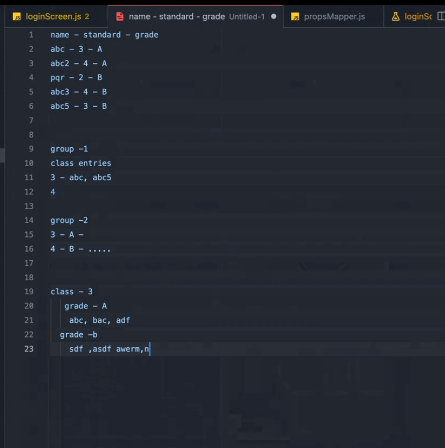

# javascriptexamples

Quokka.js
- https://marketplace.visualstudio.com/items?itemName=WallabyJs.quokka-vscode

https://onecompiler.com/tutorials/javascript/examples/examples

Instal lextenstion:
Quokka.js

| File Name                          | Image Reference                                        |
| ---------------------------------- | ------------------------------------------------------ |
| [mathSequence.js](mathSequence.js) |  |
| [dataGrouping.js](dataGrouping.js) |                |
